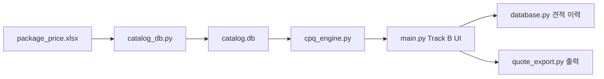

# Solu-Quote CPQ 구현 메모

작성일: 2026-07-09

## 목적

Solu-Quote는 솔루텍 견적 업무를 두 가지 방식으로 지원합니다.

- Track A: 기존 견적 방식. `base_item(A)`의 기초 항목을 수량 합산합니다.
- Track B: 신규 패키지 CPQ. `base_product(B)`의 상품 마스터와 예산대 프리셋을 조합합니다.

## 가격 마스터

기준 파일은 `package_price.xlsx`입니다.

| 시트 | 역할 |
|---|---|
| `base_item(A)` | 기존 견적 항목 |
| `base_product(B)` | 신규 패키지 CPQ 상품 마스터 |
| `package_preset_items` | 프리셋 구성품 |
| `package_presets` | 예산대 패키지 |
| `discount_policy` | 파트너 할인 한도 |

Track B에서는 `순번`을 정렬용으로만 사용하고, `항목코드`를 영구키로 사용합니다.

## 실행 흐름

## 검증 기준

- `tests/test_cpq_engine.py`가 모든 프리셋 합계, 할인 정책, 항목코드 매칭을 검증합니다.
- `package_preset_items.항목코드`는 반드시 `base_product(B).항목코드`에 존재해야 합니다.
- Track B 저장 시 `식별번호`와 `항목코드`를 혼용하지 않습니다.

## 정리 기준

레포에는 앱 실행과 검증에 필요한 파일만 남깁니다. 로그, DB, 견적 이력, 일회성 산출물은 `.gitignore`로 제외합니다.
