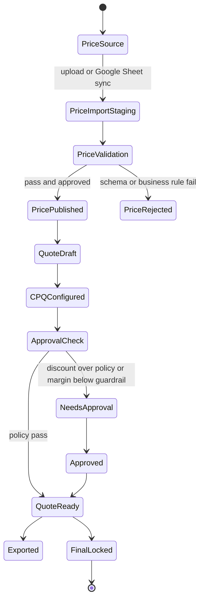

# Solu-Quote 상용수준 견적시스템 개선계획

작성일: 2026-07-09
기준 원본: `package_price.xlsx`
대상 앱: `E:\quotation-management`

## 1. 결론

현재 구현은 `package_price.xlsx` 기반 Track A/B 프로토타입으로는 유효하지만, 상용수준 견적시스템으로 쓰려면 다음 5개 축을 먼저 완성해야 한다.

1. 가격 마스터 운영 안정화
2. 견적 상태/버전/승인 워크플로우 정비
3. Track B CPQ 사용성 개선
4. 고객 제출용 출력물 품질 개선
5. 테스트/배포/감사 체계 구축

Mini CPQ 단순 파일은 폐기하고, `package_price.xlsx`의 8개 시트를 기준 데이터 모델로 삼는다.

## 2. 현재 상태 요약

### package_price.xlsx 구조

| 시트 | 역할 | 현재 규모 |
| --- | --- | --- |
| `base_item(A)` | Track A 단가합산 품목 | 29개 |
| `base_product(B)` | Track B 상품 마스터 | 24개 |
| `registered_skus` | 조달 등록 품목/식별번호 | 8개 |
| `service_packages` | 공공가치/사업 명분 패키지 | 10개 |
| `package_presets` | 예산대 프리셋 A/U/B/C/D/E | 6개 |
| `package_preset_items` | 프리셋 구성품목 | 31개 |
| `discount_policy` | 파트너 할인 한도 | 4개 |
| `_README` | 가격표 설명 | 문서용 |

### 현재 구현

- `main.py`: Streamlit UI, Track A/B 모드 제공
- `catalog_db.py`: `package_price.xlsx` 또는 CSV에서 `catalog.db` 재생성
- `cpq_engine.py`: Track B 프리셋 적재, 가격 계산, 할인 검증, 체크리스트
- `database.py`: 견적/견적품목 SQLite 저장
- `quote_export.py`: Track B 업체용/소비자용 Excel/PDF 출력

## 3. 핵심 갭

### P0: 데이터 원본 품질

| 갭 | 근거 | 영향 |
| --- | --- | --- |
| `package_presets` U행 컬럼 깨짐 | `전략메모` 안 콤마가 분리되어 6컬럼 처리 | 가격표 신뢰도 저하, 향후 자동 검증 실패 |
| 가격표 변경 이력 없음 | `catalog.db`는 매 기동 재생성만 수행 | 누가 언제 어떤 가격을 바꿨는지 추적 불가 |
| 유효일/폐기일/상태 부족 | 상품·패키지 가격에 적용기간 없음 | 과거 견적 재현 어려움 |
| 제품/패키지 키 정책 약함 | 내부제품명 중복 존재, 일부 매칭은 이름+가격 휴리스틱 | 오매칭 위험 |

### P0: 견적 상태/승인

| 갭 | 근거 | 영향 |
| --- | --- | --- |
| 버전 계산이 `created_at` 초 단위에 의존 | `database.py` version/latest 쿼리 | 같은 초 저장 시 최신/버전 오류 가능 |
| Track B 메타 저장 부족 | 프리셋코드, 서비스명, 파트너등급, 승인권자, 기존고객 여부 별도 저장 없음 | 불러오기 후 UI 복원 불완전 |
| 할인 초과가 hard block이 아님 | UI는 에러 표시하지만 저장/출력 차단과 결재 기록이 약함 | 승인 없이 견적 산출 가능 |
| final 처리 정책 불명확 | final 업데이트/신규 버전 생성 규칙 혼재 | 견적 잠금/수정 이력 훼손 가능 |

### P1: UI/UX

| 갭 | 영향 |
| --- | --- |
| Track B 화면이 단계형이지만 정보 밀도/행동 우선순위가 약함 | 영업 사용자가 무엇부터 해야 하는지 즉시 파악 어려움 |
| 프리셋 비교가 어려움 | A/U/B/C/D/E 중 선택 이유 설명 부족 |
| 고객용 가격과 파트너 공급가/마진이 같은 화면에 노출 | 화면 공유/출력 실수 위험 |
| 체크리스트가 경고 표시 수준 | 제출 가능/불가 상태가 명확하지 않음 |
| 출력 전 미리보기 부족 | 견적서 품질 확인 흐름 불편 |

### P1: 출력물

| 갭 | 영향 |
| --- | --- |
| `quote_export.py` Excel 양식이 단순 표 형태 | 기존 견적서 샘플 대비 상용 제출 품질 부족 |
| PDF 폰트/경고 리스크 | 한글 렌더링 경고, 파일명 대소문자 리스크 |
| 업체용/소비자용 분리는 있으나 권한 분리 없음 | 공급가 유출 위험 |
| 견적서 번호/원본 가격버전/승인정보 미표기 | 감사/추적 어려움 |

### P2: 운영/배포

| 갭 | 영향 |
| --- | --- |
| 사용자 인증/권한 없음 | 영업, 관리자, 승인자 구분 불가 |
| 고객/파트너 마스터 없음 | 반복 입력, 데이터 품질 저하 |
| 테스트 범위가 CPQ 엔진 중심 | UI, DB, 출력 회귀 위험 |
| README/운영 문서 미정비 | 인수인계/배포 어려움 |

## 4. 목표 아키텍처

## 5. 개선 로드맵

### Phase 0. 가격표 신뢰성 고정

목표: 가격표가 깨지면 앱이 조용히 잘못 계산하지 않고, 즉시 막는다.

- `package_price.xlsx` schema validator 추가
- 필수 컬럼, 필수값, 숫자형, 중복키, 프리셋 합계 일치 검증
- `package_presets` U행 컬럼 깨짐 수정
- 가격 원본 fingerprint, import 시각, row count 저장
- `catalog_import_log` 테이블 추가
- 가격표 유효일(`effective_from`, `effective_to`)과 상태(`active/inactive/draft`) 설계

성공 기준:
- `python validate_price_master.py` 실행 시 PASS/FAIL 명확히 출력
- 가격표 오류가 있으면 Streamlit 기동 또는 Track B 진입에서 차단
- 모든 프리셋 산출합계가 구성품목 합계와 일치

### Phase 1. 견적 저장/버전/승인 안정화

목표: 견적을 다시 열어도 같은 상태로 복원되고, 승인 없는 할인 견적이 제출되지 않는다.

- `created_at` 기반 버전 계산을 `version_no` 또는 `estimate_id` 기준으로 변경
- `quote_meta` 또는 `estimate_meta` JSON 테이블 추가
- Track B 저장 메타:
  - `preset_code`
  - `service_package_id/name`
  - `partner_grade`
  - `discount_rate`
  - `approver`
  - `approval_reason`
  - `existing_customer`
  - `price_source_fingerprint`
- 할인 정책 hard block:
  - 한도 초과: 승인권자+승인사유 필수
  - 마진 음수: 관리자 승인 필수 또는 저장 차단
- final 견적 잠금:
  - final 저장 후 직접 수정 금지
  - 수정 시 새 버전 생성

성공 기준:
- 같은 초에 여러 번 저장해도 버전 번호가 정확
- Track B 견적 불러오기 후 프리셋/할인/기존고객 상태가 그대로 복원
- 승인권자 없는 할인 견적은 저장/출력 불가

### Phase 2. Track B UI 상용화

목표: 영업 사용자가 3분 안에 견적 초안을 만들고, 왜 이 패키지인지 설명할 수 있다.

- 화면을 5단계 wizard로 재구성:
  1. 고객/사업 정보
  2. 공공가치/명분 선택
  3. 예산대 프리셋 비교
  4. 구성품목/수량 조정
  5. 할인/승인/출력
- 프리셋 비교 카드:
  - 총액
  - 권장가격대
  - 주요 구성품목
  - 적합 수요처
  - 등록/신규후보/커스터마이징 비율
- 구성품목 편집 개선:
  - 품목 추가/삭제
  - 제품 마스터 검색 추가
  - 등록품목 식별번호 표시
  - 의존성 누락 자동 경고
- 내부용/고객 공유용 화면 분리:
  - 고객용: 공급가/마진 숨김
  - 내부용: 공급가/마진/할인 승인 표시
- 제출 가능 상태 배지:
  - Pass=green
  - Fail=red
  - Pending=orange

성공 기준:
- 신규 고객 A 프리셋, 기존 고객 U 프리셋 경로가 명확
- 할인/녹취기반/VR중복/무상항목 체크 중 Fail 있으면 출력 전 명확히 표시
- 고객 공유 화면에 공급가/마진이 노출되지 않음

### Phase 3. 견적서 출력 상용화

목표: Excel/PDF 출력물이 바로 고객 제출 가능해야 한다.

- 기존견적서 샘플 양식 기반 Excel 템플릿 적용
- 출력물 구성:
  - 고객 제출용 견적서
  - 내부 검토용 공급가/마진표
  - 식별번호 조합표
  - 제출 체크리스트
  - 표준 특이사항/VR 중복방지 문구
- 견적서 번호 체계:
  - `SQ-YYYYMMDD-CUSTOMER-SEQ`
- 가격버전/승인정보 footer 또는 숨김 시트 기록
- PDF는 Excel 기반 변환 또는 reportlab 기반 재구축 중 택일
- 회사 정보/주소/전화번호 단일 상수화

성공 기준:
- Excel 출력이 기존견적서 샘플과 유사한 품질
- 소비자용 파일에 공급가/마진 미노출
- 내부용 파일에는 공급가/할인/마진/승인정보 포함

### Phase 4. 운영 기능

목표: 개인 데모 앱이 아니라 팀이 쓰는 견적시스템으로 전환한다.

- 사용자/권한:
  - 영업: 견적 작성
  - 승인자: 할인 승인
  - 관리자: 가격표 import/publish
- 고객/파트너 마스터:
  - 고객사, 기관, 담당자, 지역, 산업군
  - 파트너 등급, 담당 영업, 할인 정책
- 견적 검색/대시보드:
  - 상태별: draft/pending approval/approved/final
  - 기간별/고객별/파트너별
- 로그:
  - 가격 import
  - 견적 생성/수정/출력
  - 승인/반려
- 배포:
  - 로컬 Streamlit → 내부 서버 배포
  - SQLite 유지 또는 PostgreSQL 전환 판단

성공 기준:
- 사용자별 권한으로 공급가/마진 노출 제어
- 견적 이력에서 가격버전/승인/출력 파일 추적 가능

## 6. 추천 구현 순서

### Sprint 1: 안정화

1. 가격표 validator
2. 가격 import log
3. 버전 계산 수정
4. Track B 메타 저장/복원
5. 할인 hard block

### Sprint 2: UI 개선

1. Track B wizard 구조
2. 프리셋 비교 카드
3. 제품 검색/품목 추가
4. 내부용/고객용 표시 분리
5. 체크리스트 상태 배지

### Sprint 3: 출력 개선

1. 기존견적서 샘플 기반 Excel 템플릿
2. 고객용/내부용/식별번호 시트
3. 견적번호/가격버전/footer
4. PDF 출력 안정화

### Sprint 4: 운영화

1. 고객/파트너 마스터
2. 승인 워크플로우
3. 견적 검색/대시보드
4. 인증/권한
5. 서버 배포

## 7. 우선 개발 티켓

| 우선순위 | 티켓 | 산출물 |
| --- | --- | --- |
| P0 | 가격표 schema validator | `validate_price_master.py`, 테스트 |
| P0 | 버전/최신 판정 개선 | DB migration, 회귀 테스트 |
| P0 | Track B 메타 저장/복원 | `estimate_meta` 테이블, UI 복원 |
| P0 | 할인 승인 hard block | 저장/출력 차단, 승인 필드 |
| P1 | Track B wizard UI | `main.py` 구조 개선 |
| P1 | 프리셋 비교 카드 | 패키지 비교 UI |
| P1 | 견적서 Excel 템플릿 | `quote_export.py` 재작성 |
| P1 | 고객용/내부용 노출 분리 | 권한 전 단계의 명시 토글 |
| P2 | 고객/파트너 마스터 | 신규 테이블/관리 화면 |
| P2 | 인증/권한 | 내부 서버 배포 전제 |

## 8. 구현 시 주의

- Track A는 폐기하지 않는다. 현장 익숙도 때문에 병행 유지한다.
- Track B가 기본 추천 경로가 되도록 UI 우선순위를 조정한다.
- 가격표 원본은 반드시 `package_price.xlsx` 기준으로 둔다.
- Mini CPQ 단순 파일은 참조하지 않는다.
- 공급가/마진은 고객용 출력과 화면공유에서 절대 노출되지 않도록 분리한다.
- 가격/견적/승인 이력은 나중에 감사 가능한 형태로 저장한다.
